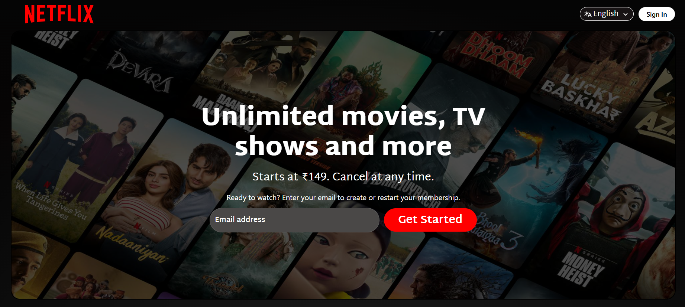

# Netflix Homepage Clone 🎬

This is a front-end clone of the Netflix homepage built using HTML, CSS and JS.

## 📸 Screenshot

## Features
- Netflix-style layout design
- Click on a show for more details (like description, genre)
- Watch the trailer via embedded Youtube link
- Dynamic rendering of content
- Responsive design
- Hover effects

## Technologies Used
- HTML5
- CSS3
- Javascript

##  How to Use
1. Clone this repository:
2. Open `index.html` in your browser.

##  Disclaimer
This project is for educational purposes only.  
All trademarks and images belong to their respective owners.

##  License
For personal use only
